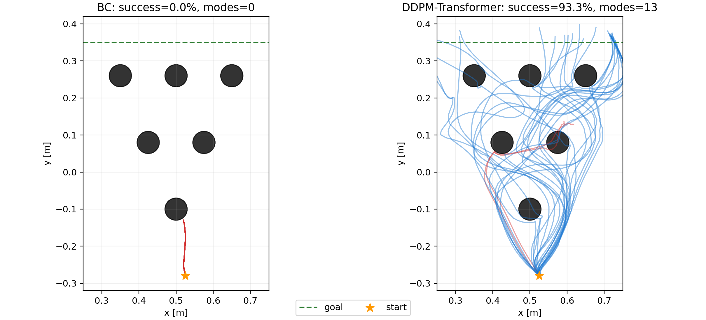

# Avoiding 任务：BC 与 DDPM-Transformer 实验总结

> **结果更新：** 本文中的 DDPM-Transformer 93.3% 成功率来自早期 30 条小样本评估。后续 480 条评估得到 40.4% 成功率和 17/24 成功模式覆盖，应优先采用后者。详见 [02_ddpm_transformer_480_mode_evaluation.md](02_ddpm_transformer_480_mode_evaluation.md)。

## 1. 实验目的

本实验在 D3IL Benchmark 的 Avoiding 任务上训练并比较以下两种状态策略：

- **Behavior Cloning（BC）**：使用 MLP 直接从当前状态回归动作。
- **DDPM-Transformer**：使用 Transformer 编码最近的状态历史，并通过条件扩散过程生成动作。

实验重点考察两种方法在多模态绕障任务中的闭环成功率、成功路径模式覆盖和轨迹差异。

## 2. 计算环境

实验于 2026-07-16 在 Bridges-2 GPU 节点上执行：

| 项目 | 配置 |
|---|---|
| GPU | NVIDIA Tesla V100-SXM2，32 GB |
| CPU | Slurm 作业分配 5 核 |
| 系统内存 | 约 503 GiB，总可用约 478 GiB |
| Python | 3.10.8 |
| PyTorch | 1.13.0+cu117 |
| Gym | 0.21.0 |
| MuJoCo | 2.3.2 |
| Pinocchio | 2.6.21 |

训练开始前 GPU 处于空闲状态。训练和轨迹采集结束后，GPU 显存已释放。

## 3. 数据与任务设置

- 任务：D3IL Avoiding。
- 输入状态维度：4。
- 动作维度：2。
- 最大轨迹长度：200。
- 原始演示文件：96 条 `.pkl` 轨迹。
- `window_size=1` 时得到 7,305 个训练窗口。
- `window_size=5` 时得到 6,921 个训练窗口。
- 状态和动作均使用训练数据统计量归一化。
- 随机种子：42。

当前配置中的 `trainset` 和 `valset` 指向同一个数据目录，因此离线验证损失不能视为严格的独立测试集结果。最终比较主要依据 MuJoCo 闭环 rollout。

## 4. 模型与训练配置

### 4.1 BC

- 策略：状态编码器 + MLP 动作回归。
- 参数量：99,970。
- 历史窗口：1。
- 损失：预测动作与专家动作之间的 MSE。
- Epoch：200。
- Batch size：1,024。
- 每 10 epochs 评估并保存最优模型。

训练命令：

```bash
conda activate d3il

python run.py --config-name=avoiding_config \
  agents=bc_agent \
  agent_name=bc \
  window_size=1 \
  epoch=200 \
  eval_every_n_epochs=10 \
  train_only=True \
  simulation.render=False \
  hydra.run.dir=logs/avoiding/trained/bc_seed42
```

### 4.2 DDPM-Transformer

- 策略：Transformer 条件网络 + DDPM 动作生成。
- 参数量：274,826。
- 历史窗口：5。
- 扩散采样步数：8。
- 噪声调度：cosine。
- 使用 EMA 模型权重。
- Epoch：200。
- Batch size：1,024。
- 每 10 epochs 评估并保存最优模型。

训练命令：

```bash
python run.py --config-name=avoiding_config \
  agents=ddpm_transformer_agent \
  agent_name=ddpm_transformer \
  window_size=5 \
  epoch=200 \
  eval_every_n_epochs=10 \
  train_only=True \
  simulation.render=False \
  agents.model.n_timesteps=8 \
  hydra.run.dir=logs/avoiding/trained/ddpm_transformer_seed42
```

`train_only` 用于将训练与仿真分离，避免训练结束后旧仿真代码在 Slurm CPU affinity 上失败。轨迹评估由独立脚本执行。

## 5. 离线训练结果

| 模型 | 最优评估 epoch | 最优评估损失 | 最后一次评估损失 |
|---|---:|---:|---:|
| BC | 189 | 0.1933 | 0.2148 |
| DDPM-Transformer | 199 | 0.0967 | 0.0967 |

注意：BC 评估的是动作回归 MSE，而 DDPM 评估的是扩散去噪目标，两者数值不应被视为完全同尺度的直接比较。该结果主要用于各模型内部选择 checkpoint。

## 6. 闭环轨迹评估

使用各模型的最优 checkpoint，在无渲染 MuJoCo 环境中分别执行 30 条轨迹。两组实验使用相同的基础随机种子 42。

评估命令：

```bash
MPLBACKEND=Agg python visualize_avoiding.py \
  --n-trajectories 30 \
  --seed 42 \
  --output-dir logs/avoiding/trajectory_comparison
```

### 6.1 定量结果

| 模型 | 成功率 | 成功轨迹 | 成功模式数 | 归一化模式熵 |
|---|---:|---:|---:|---:|
| BC | 0.0% | 0 / 30 | 0 | 0.000 |
| DDPM-Transformer | 93.3% | 28 / 30 | 13 | 0.738 |

轨迹对比图：



图中蓝线表示成功轨迹，红线表示失败轨迹，黑色圆形表示障碍物，绿色虚线表示目标线。

## 7. 结果分析

### 7.1 Avoiding 是多模态决策问题

机器人在每一层障碍前通常有多个合理通道，例如从左侧或右侧绕过。专家数据因此对应条件动作分布中的多个峰，而不是唯一动作。

普通 BC 使用 MSE 学习条件均值：

\[
\hat a(s)=\mathbb{E}[a\mid s].
\]

当同一类状态附近同时存在向左和向右的专家动作时，条件均值可能指向两个模式之间，即障碍物中心附近。这可以得到尚可的离线 MSE，却会在闭环执行中产生碰撞。本实验中 BC 的 30 条 rollout 全部失败，与这一典型的 mode averaging 现象一致。

### 7.2 DDPM 保留多峰动作分布

DDPM-Transformer 学习条件生成分布，而不是输出单一条件均值。扩散采样可以生成某一个完整的合理动作模式，从而保留左绕、右绕及多层通道组合。本实验中 DDPM-Transformer 的 28 条成功轨迹覆盖 13 种模式，归一化模式熵达到 0.738，说明模型没有退化为单一路线。

### 7.3 历史窗口提高路径一致性

BC 仅使用当前状态（`window_size=1`），DDPM-Transformer 使用最近 5 步状态。历史信息能够帮助模型识别已经选择的绕障方向和当前运动趋势，从而在后续步骤中保持一致，而不是在不同路径模式之间切换。

### 7.4 闭环分布偏移

训练数据来自专家轨迹，但执行时策略会访问由自身动作产生的状态。BC 一旦产生轻微偏差，就可能进入训练数据覆盖较弱的区域，并形成“动作误差—状态偏移—更大动作误差”的累积过程。DDPM 的多模态生成能力和历史条件在本实验中表现出更好的闭环鲁棒性。

### 7.5 模型容量不是唯一解释

DDPM-Transformer 的参数量约为 BC 的 2.75 倍，因此模型容量可能贡献部分性能差异。但 13 种成功模式和较高模式熵更直接地表明，分布建模方式和时序条件是关键因素。后续应通过参数量匹配、Transformer-BC 和 MLP-DDPM 等消融实验进一步分离这些影响。

## 8. 结论

在当前单 seed 实验中，DDPM-Transformer 明显优于确定性 BC：成功率从 0% 提升至 93.3%，并覆盖 13 种成功绕障模式。结果支持以下判断：对于具有多条合理路径的机器人模仿学习任务，直接 MSE 回归容易产生模式平均，而条件扩散模型能够更好地保留多模态行为；Transformer 历史窗口进一步提高了路径选择的一致性。

## 9. 局限与后续实验

当前结论仍有以下限制：

1. 仅训练了 seed 42，尚无跨随机种子的均值和方差。
2. 训练集与验证集来自同一目录，离线评估并非严格独立。
3. BC 与 DDPM-Transformer 的参数量、历史窗口和生成机制同时不同。
4. 每个模型仅评估 30 条轨迹，成功率仍存在抽样误差。
5. 尚未报告碰撞位置、路径长度、最小障碍距离和执行耗时。

建议后续执行：

- 使用 seeds 0–5 重复实验，报告成功率和模式熵的均值及标准差。
- 划分独立训练、验证和测试演示集合。
- 增加 GPT-BC 或 Transformer-BC，分离时序建模与扩散建模的贡献。
- 比较 MLP-DDPM 与 DDPM-Transformer，评估 Transformer 的独立贡献。
- 统计路径长度、最小障碍距离、碰撞层级和单步推理延迟。
- 增加不同扩散步数和历史窗口长度的消融实验。

## 10. 实验产物

- BC 最优权重：`logs/avoiding/trained/bc_seed42/eval_best_bc.pth`
- DDPM-Transformer 最优权重：`logs/avoiding/trained/ddpm_transformer_seed42/eval_best_ddpm.pth`
- BC 训练日志：`logs/avoiding/trained/bc_seed42/run.log`
- DDPM-Transformer 训练日志：`logs/avoiding/trained/ddpm_transformer_seed42/run.log`
- 轨迹指标：`logs/avoiding/trajectory_comparison/metrics.json`
- 轨迹对比图：`logs/avoiding/trajectory_comparison/trajectory_comparison.png`
- BC 原始轨迹：`logs/avoiding/trajectory_comparison/bc_trajectories.npz`
- DDPM-Transformer 原始轨迹：`logs/avoiding/trajectory_comparison/ddpm_transformer_trajectories.npz`
- 可视化脚本：`visualize_avoiding.py`
