# DDPM-Transformer：480 条 Avoiding 轨迹与 24-Mode 覆盖分析

## 1. 实验目的

此前使用 30 条 rollout 评估 DDPM-Transformer，得到 93.3% 成功率和 13 个成功模式。由于样本量较小，本实验将评估规模扩大到 480 条轨迹，用于获得更可靠的闭环成功率，并统计理论上 24 种绕障模式的实际出现次数。

## 2. 评估设置

- 模型：`logs/avoiding/trained/ddpm_transformer_seed42/eval_best_ddpm.pth`
- 模型训练 seed：42。
- 评估轨迹数：480。
- 基础评估 seed：42。
- Transformer 历史窗口：5。
- 扩散采样步数：8。
- DDPM 推理运行于 GPU，MuJoCo 物理仿真运行于 CPU。
- 环境：无渲染 Avoiding MuJoCo 环境。

运行命令：

```bash
conda activate d3il

MPLBACKEND=Agg python visualize_avoiding.py \
  --models ddpm \
  --n-trajectories 480 \
  --seed 42 \
  --output-dir logs/avoiding/ddpm_480_rollouts
```

## 3. Mode 定义

Avoiding 环境共包含三层障碍物，分别提供 2、3、4 个通道，因此理论路径组合数为：

\[
2\times3\times4=24.
\]

本文用 `a-b-c` 表示一个 mode，其中 `a`、`b`、`c` 分别是第一、第二、第三层选择的通道编号。

训练数据包含 96 条专家轨迹，实际覆盖全部 24 种模式；其中 22 种各有 4 条轨迹，另外两种分别有 3 条和 5 条，整体接近均衡。

## 4. 总体结果

| 指标 | 结果 |
|---|---:|
| 总 rollout 数 | 480 |
| 成功轨迹 | 194 |
| 失败轨迹 | 286 |
| 成功率 | 40.4% |
| 完整经过三层的轨迹 | 197 |
| 第三层前碰撞或终止 | 283 |
| 完整经过三层但最终失败 | 3 |
| 成功模式覆盖 | 17 / 24 |
| 归一化成功模式熵 | 0.711 |

大多数失败发生在完成三层通道选择之前。只要轨迹完整经过第三层，194/197 最终成功，说明主要瓶颈是前中段避障，而不是通过第三层后的终点到达。

### 4.1 480 条轨迹可视化

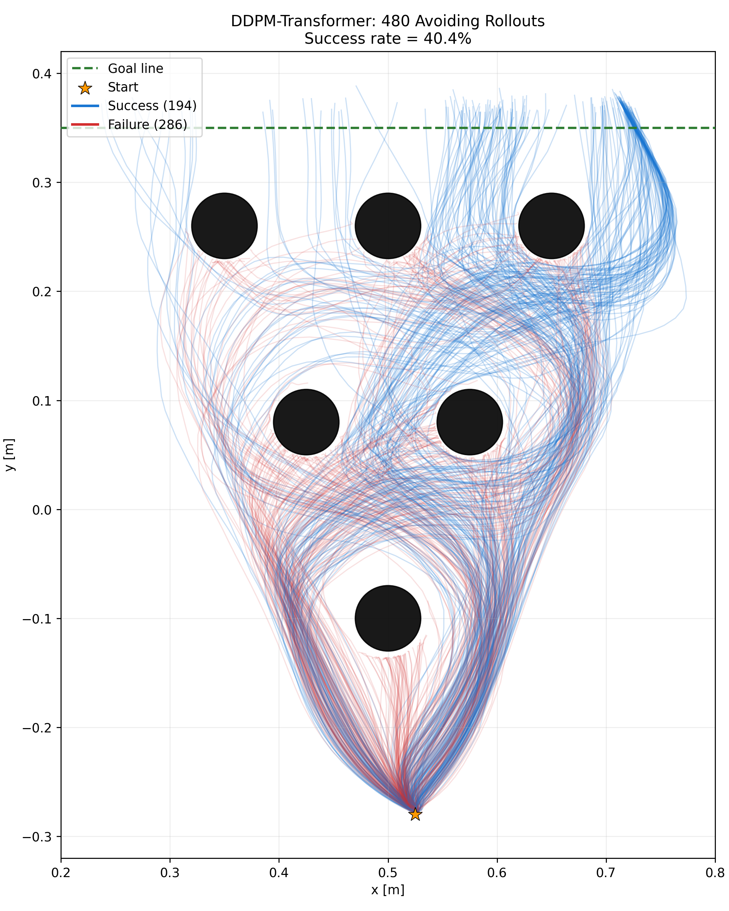

蓝色表示成功轨迹，红色表示失败轨迹；黑色圆形为障碍物，橙色星形为起点，绿色虚线为目标线。由于共有 480 条轨迹，绘图使用透明度叠加，颜色较深的区域表示策略更频繁经过的路径。

## 5. 24 种模式出现次数

下表中的“完整次数”指轨迹被记录到三个通道选择；“成功次数”仅统计最终到达目标的轨迹。

| Mode | 完整次数 | 成功次数 | 完整但失败 |
|---|---:|---:|---:|
| 1-1-1 | 2 | 2 | 0 |
| 1-1-2 | 0 | 0 | 0 |
| 1-1-3 | 1 | 1 | 0 |
| 1-1-4 | 9 | 9 | 0 |
| 1-2-1 | 0 | 0 | 0 |
| 1-2-2 | 0 | 0 | 0 |
| 1-2-3 | 0 | 0 | 0 |
| 1-2-4 | 13 | 13 | 0 |
| 1-3-1 | 2 | 2 | 0 |
| 1-3-2 | 2 | 2 | 0 |
| 1-3-3 | 28 | 28 | 0 |
| 1-3-4 | 8 | 8 | 0 |
| 2-1-1 | 6 | 6 | 0 |
| 2-1-2 | 1 | 0 | 1 |
| 2-1-3 | 6 | 6 | 0 |
| 2-1-4 | 5 | 5 | 0 |
| 2-2-1 | 0 | 0 | 0 |
| 2-2-2 | 3 | 3 | 0 |
| 2-2-3 | 2 | 0 | 2 |
| 2-2-4 | 55 | 55 | 0 |
| 2-3-1 | 1 | 1 | 0 |
| 2-3-2 | 7 | 7 | 0 |
| 2-3-3 | 34 | 34 | 0 |
| 2-3-4 | 12 | 12 | 0 |

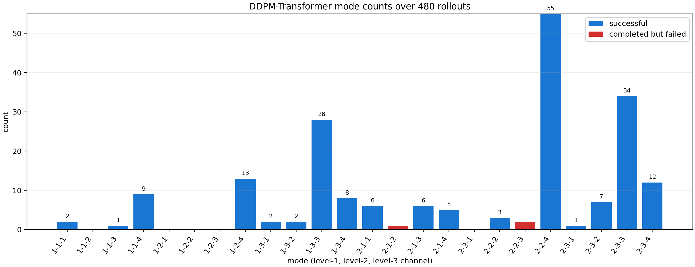

## 6. 模式分布分析

推理分布并未复现训练数据中接近均衡的 24-mode 分布，而是明显集中于少数模式：

- `2-2-4`：55 次成功，占全部成功轨迹的 28.4%。
- `2-3-3`：34 次，占 17.5%。
- `1-3-3`：28 次，占 14.4%。
- 上述三种模式合计占成功轨迹的 60.3%。
- 7 种模式没有成功出现：`1-1-2`、`1-2-1`、`1-2-2`、`1-2-3`、`2-1-2`、`2-2-1`、`2-2-3`。

因此，当前 DDPM-Transformer 虽具备明显的多模态能力，但存在 mode preference 或部分 mode collapse。模型的训练目标是动作去噪，不包含显式模式标签或均衡约束，因此不能保证生成分布与专家的模式先验一致。

## 7. 30 条与 480 条结果差异

| 评估规模 | 成功率 | 成功模式数 | 模式熵 |
|---|---:|---:|---:|
| 30 条 | 93.3% | 13 | 0.738 |
| 480 条 | 40.4% | 17 | 0.711 |

30 条实验显著高估了成功率。主要原因包括：

1. 30 条样本量较小，随机采样可能恰好集中在容易成功的动作模式。
2. DDPM 推理每一步都从噪声开始生成动作，评估本身具有较大随机方差。
3. 当前代码没有启用 CUDA 严格确定性模式；即使使用相同 seed，两次运行也不保证逐条一致。
4. MuJoCo 闭环会放大微小动作差异，使轨迹最终落入成功或碰撞两种不同结果。

验证中，两次实验各自前 30 条轨迹的成功数分别为 28 和 13，说明当前评估流程确实未达到逐轨迹可重复。后续论文实验应将 480 条或多 seed 大样本评估作为主要结果，并完善确定性设置。

## 8. 训练轮数与 Cosine LR 改进实验

为检验原模型是否训练不充分，在保持模型结构、`window_size=5`、8 个扩散步和 seed 42 不变的前提下，分别从头训练 500、1000、2000、4000、8000、10000、12000 和 15000 epochs。各实验均使用余弦学习率衰减，初始学习率为 `5e-4`，最终学习率为 `1e-6`，`T_max` 与总训练轮数保持一致。

| 配置 | 最优 checkpoint | 最优离线损失 |
|---|---:|---:|
| 200 epochs，固定 LR | epoch 199 | 0.09670 |
| 500 epochs，Cosine LR | epoch 449 | 0.07839 |
| 1000 epochs，Cosine LR | epoch 919 | 0.06200 |
| 2000 epochs，Cosine LR | epoch 1559 | 0.05014 |
| 4000 epochs，Cosine LR | epoch 3469 | **0.03662** |
| 8000 epochs，Cosine LR | epoch 7599 | **0.02319** |
| 10000 epochs，Cosine LR | epoch 9809 | **0.01957** |
| 12000 epochs，Cosine LR | epoch 11739 | **0.01737** |
| 15000 epochs，Cosine LR | epoch 13639 | **0.01470** |

离线损失随训练轮数持续下降。当前 `trainset` 与 `valset` 指向同一数据目录，因此该指标主要用于同次训练中的 checkpoint 选择，模型优劣仍以 MuJoCo 闭环 rollout 为准。

### 8.1 480 条闭环评估对比

| 配置 | 成功率 | 成功轨迹 | 成功模式覆盖 | 模式熵 | 第三层前失败 | 完整但失败 |
|---|---:|---:|---:|---:|---:|---:|
| 200 epochs，固定 LR | 40.4% | 194 / 480 | 17 / 24 | 0.711 | 283 | 3 |
| 500 epochs，Cosine LR | 45.4% | 218 / 480 | 22 / 24 | 0.804 | 259 | 3 |
| 1000 epochs，Cosine LR | 64.8% | 311 / 480 | 24 / 24 | 0.884 | 157 | 12 |
| 2000 epochs，Cosine LR | 88.5% | 425 / 480 | 24 / 24 | 0.877 | 54 | 1 |
| 4000 epochs，Cosine LR | **96.3%** | **462 / 480** | 23 / 24 | **0.891** | **16** | 2 |
| 8000 epochs，Cosine LR | 95.4% | 458 / 480 | **24 / 24** | **0.914** | 21 | **1** |
| 10000 epochs，Cosine LR | **97.5%** | **468 / 480** | **24 / 24** | 0.913 | **11** | **1** |
| 12000 epochs，Cosine LR | 97.1% | 466 / 480 | **24 / 24** | 0.925 | — | — |
| 15000 epochs，Cosine LR | 95.0% | 456 / 480 | **24 / 24** | **0.936** | — | — |

### 8.2 成功率随训练轮数变化

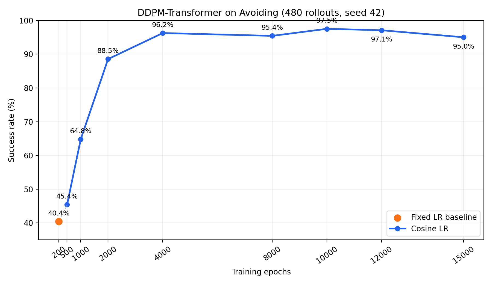

折线图汇总了当前全部 480-rollout 实验。200-epoch 点使用固定学习率，仅作为原始基线；500–15000 epochs 均采用 `CosineAnnealingLR`。成功率在 2000 epochs 前快速增长，4000 epochs 后进入 95%–97.5% 的平台区，并出现小幅非单调波动。当前最高单次结果仍为 10000 epochs 的 97.5%，继续增加到 12000 和 15000 epochs 没有带来更高成功率。

500-epoch 模型的成功率提升了 5.0 个百分点，成功轨迹增加 24 条；模式覆盖从 17 种提升至 22 种，模式熵也明显提高。第三层前失败由 283 条减少至 259 条，说明更充分的训练和学习率衰减改善了早期闭环稳定性，但早期碰撞仍是主要瓶颈。

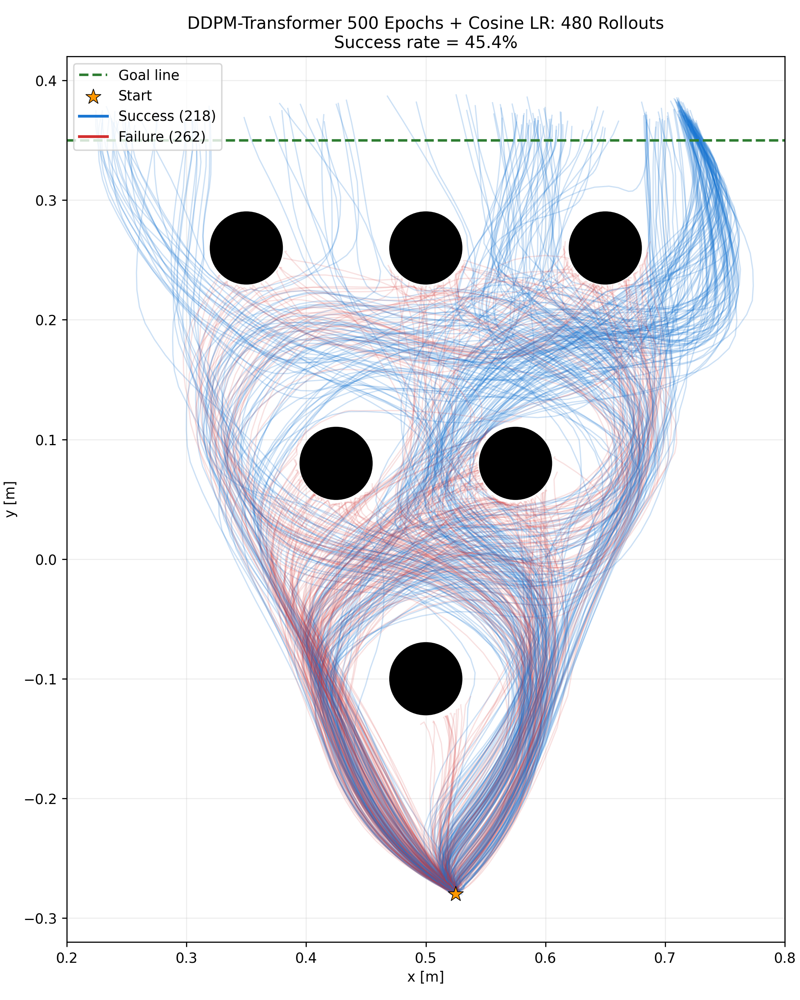

500-epoch 模型仅有 `1-2-2` 和 `2-1-2` 两种模式未成功出现。不过，成功分布仍明显偏向 `2-2-4`，该模式出现 63 次。因此，延长训练显著改善了覆盖，但没有完全消除 mode preference。

### 8.3 1000 与 2000 Epochs 结果

1000-epoch 模型进一步达到 64.8% 成功率，并首次覆盖全部 24 种成功模式。第三层前失败从 500-epoch 模型的 259 条下降至 157 条，说明训练时间增加后，策略在早期闭环中的动作稳定性继续改善。

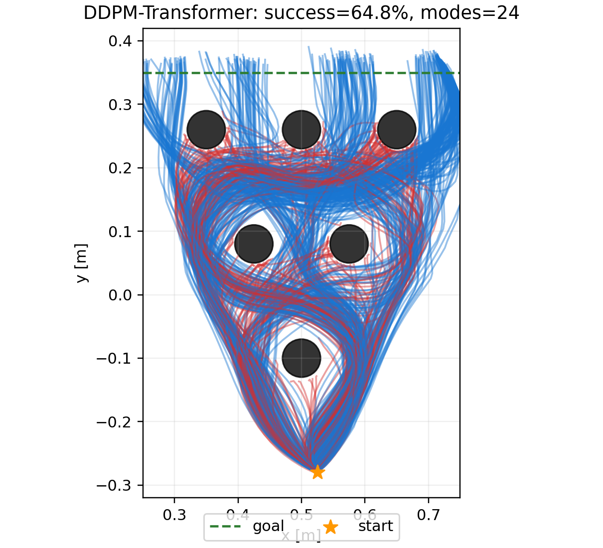

2000-epoch 模型达到本组实验最佳结果：425/480 条轨迹成功，成功率为 88.5%，全部 24 种模式均有成功样本。426 条轨迹完整经过第三层，其中 425 条最终成功；第三层前失败仅剩 54 条，完整通过三层后失败仅 1 条。

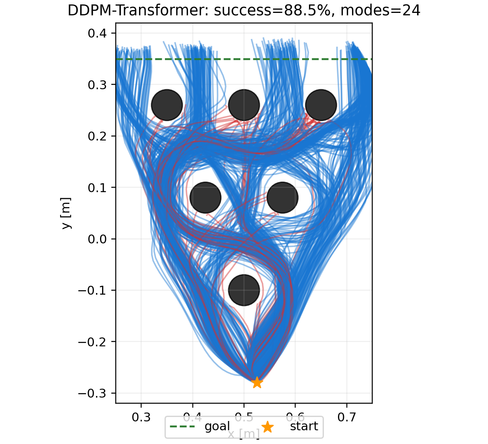

从 200 到 2000 epochs，成功率由 40.4% 提升至 88.5%，提高 48.1 个百分点；第三层前失败由 283 条下降至 54 条，减少 80.9%。因此，当前证据强烈支持此前 DDPM-Transformer 成功率偏低的主要原因之一是训练不足，性能增益主要来自早期闭环避障稳定性的提升。

2000-epoch 模型的模式熵为 0.877，略低于 1000-epoch 模型的 0.884，但仍保持完整的 24/24 模式覆盖。这说明成功率提升没有导致明显的模式丢失，不过成功模式频率仍不是完全均衡。

由于当前评估尚未达到严格确定性，并且每个训练配置只使用一个训练 seed 和一次 480-rollout 评估，具体百分点仍可能受到随机性影响。尤其需要通过多训练 seed 和多评估 seed 验证 1000 到 2000 epochs 的增益是否稳定。

### 8.4 4000 Epochs 结果

4000-epoch 模型的最优 checkpoint 出现在 epoch 3469，离线损失进一步下降至 0.03662，相比 2000-epoch 模型的 0.05014 下降约 27.0%。在 480 条闭环 rollout 中，462 条成功，成功率达到 96.25%。

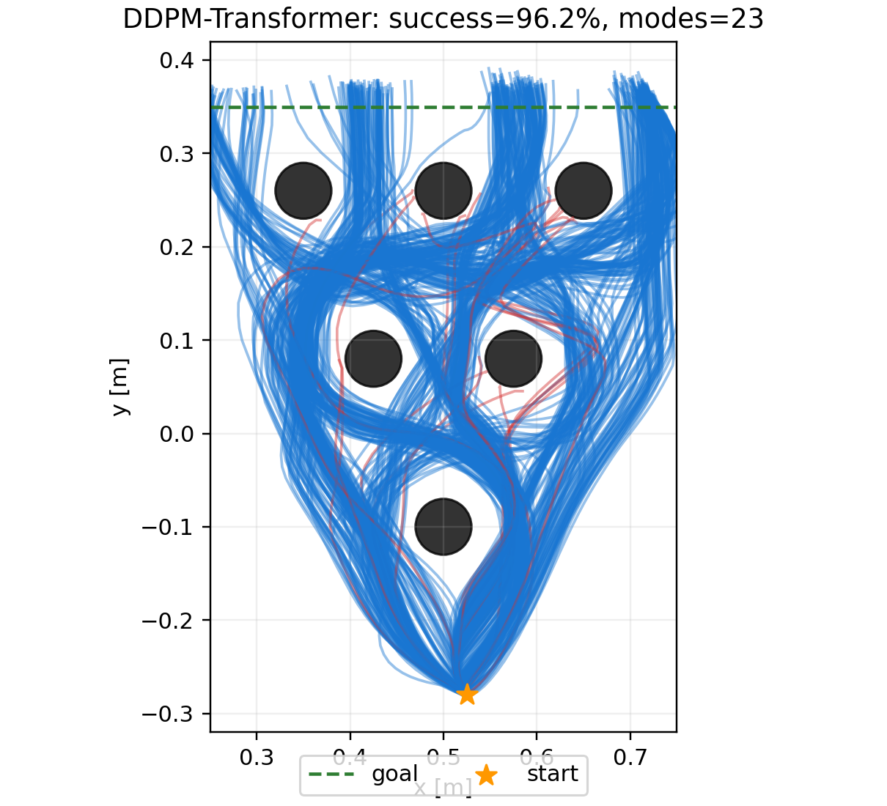

4000-epoch 模型共有 464 条轨迹完整经过第三层，其中 462 条最终成功；第三层前失败仅 16 条，完整通过三层后失败 2 条。相比 2000 epochs，成功率提高 7.7 个百分点，早期失败由 54 条减少至 16 条，说明更长训练仍在改善早期闭环避障稳定性，但边际成功率收益已开始小于 1000 到 2000 epochs 阶段。

本次成功轨迹覆盖 23/24 种模式，唯一未成功出现的是 `1-3-4`。模式熵为 0.891，高于 2000-epoch 模型的 0.877。由于 1000 和 2000 epochs 均曾在相同规模评估中覆盖 24/24，且 DDPM 推理具有随机性，单次评估缺少 `1-3-4` 更可能是有限采样波动，而不能直接判定为训练加深导致的 mode collapse。

从 200 到 4000 epochs，成功率由 40.4% 提升至 96.3%，累计提高 55.9 个百分点；第三层前失败由 283 条下降至 16 条，减少 94.3%。结合离线损失持续下降，当前实验进一步确认早期模型的主要问题是训练不足。

### 8.5 8000 Epochs 与重复评估

8000-epoch 模型的最优 checkpoint 出现在 epoch 7599，离线损失为 0.02319。第一次 480 条闭环评估成功 458 条，成功率为 95.42%；成功覆盖全部 24 种模式，模式熵为 0.914。459 条轨迹完整经过第三层，其中 458 条成功；第三层前失败 21 条，完整但失败 1 条。

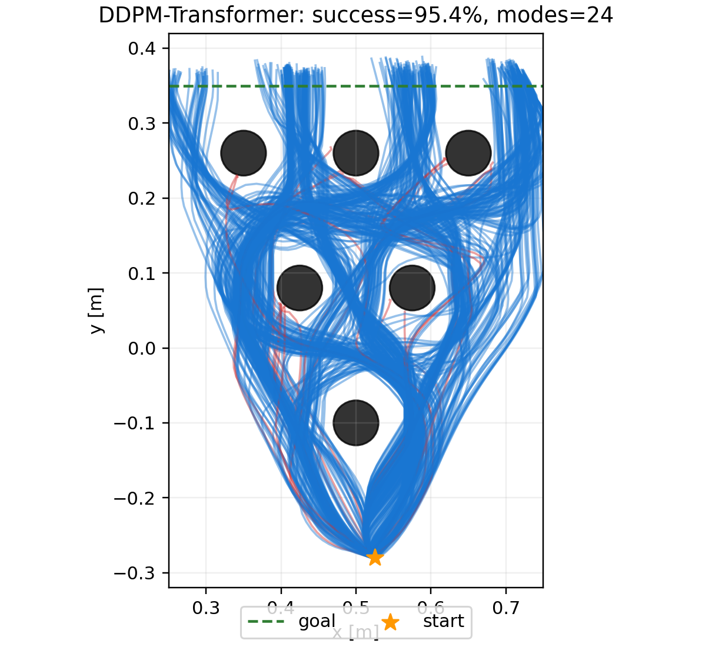

为检查评估波动，使用相同 checkpoint 和相同 seed 42 再运行一次 480 条评估。第二次结果仍为 458/480、24/24 模式覆盖和 0.914 模式熵；原始轨迹 NPZ 与轨迹图的 SHA-256 哈希也与第一次完全相同。因此，当前相同 seed 的评估流程可以逐轨迹复现，这次重复实验验证了确定性，但不能用来估计跨 seed 随机方差。

8000 epochs 的成功率比 4000 epochs 低 0.83 个百分点（少 4 条成功），但恢复了 24/24 模式覆盖，模式熵由 0.891 提高至 0.914。综合来看，4000 epochs 后闭环成功率已基本饱和；继续训练的主要增益体现在离线损失、模式覆盖和分布均衡性，而非单次成功率。

### 8.6 10000 Epochs 结果

10000-epoch 模型的最优 checkpoint 出现在 epoch 9809，离线损失进一步下降至 0.01957。在 480 条闭环 rollout 中成功 468 条，成功率达到 97.50%，为当前所有配置中的最高结果；同时覆盖全部 24 种模式，模式熵为 0.913。

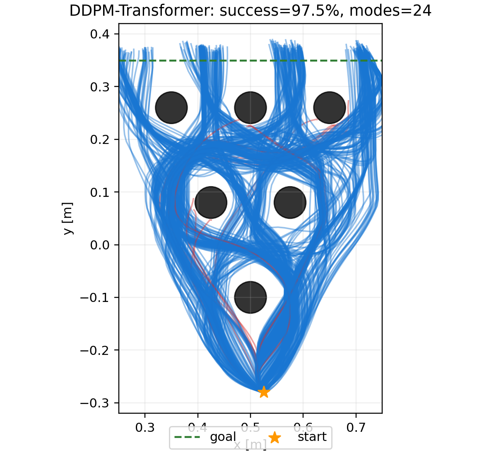

469 条轨迹完整经过第三层，其中 468 条最终成功；第三层前失败仅 11 条，完整但失败 1 条。相比 8000 epochs，成功率提高 2.08 个百分点（增加 10 条成功），早期失败由 21 条降至 11 条；相比 4000 epochs，成功率提高 1.25 个百分点，并恢复 24/24 模式覆盖。

10000 epochs 同时取得当前最高闭环成功率、完整模式覆盖和较高模式熵，说明8000轮时的小幅回落不是持续恶化。不过，4000–10000 epochs 的成功率均已超过95%，后续提升空间有限，应通过多训练 seed 和不同评估 seed 判断增益是否稳定。

### 8.7 12000 与 15000 Epochs 结果

12000-epoch 模型的最优离线损失为 0.01737（epoch 11739）。480 条闭环 rollout 中成功 466 条，成功率为 97.08%，覆盖全部 24 种模式，归一化模式熵为 0.925。

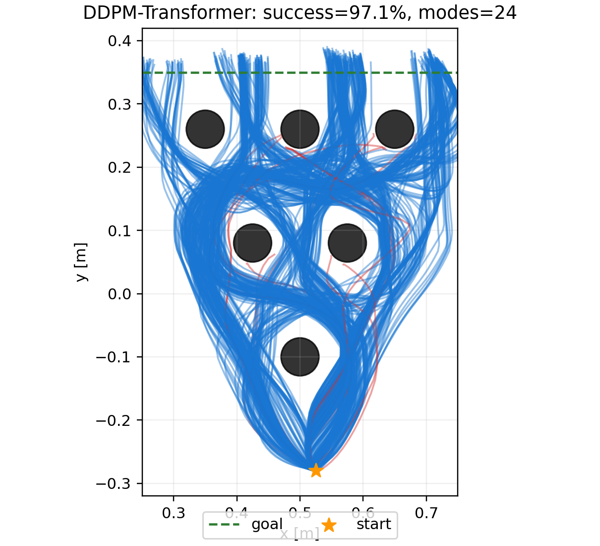

15000-epoch 模型的最优离线损失继续下降至 0.01470（epoch 13639），但闭环仅成功 456/480 条，成功率为 95.00%。其模式覆盖仍为 24/24，模式熵进一步提高至当前最高的 0.936。

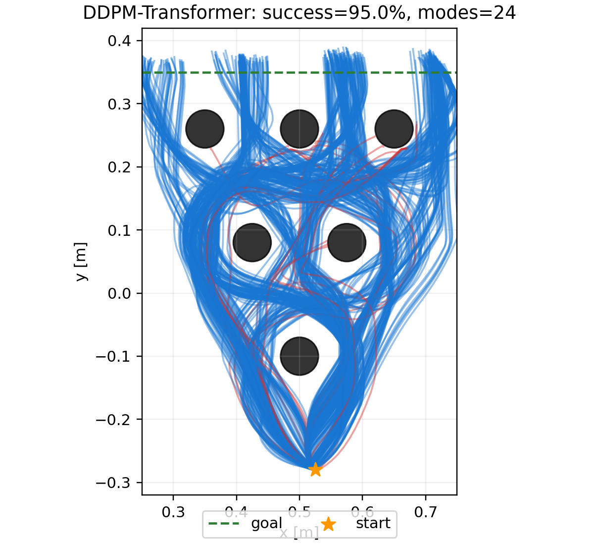

这两组结果表明，离线去噪损失持续下降并不保证闭环成功率单调上升。10000、12000、15000 epochs 的成功率分别为 97.50%、97.08%、95.00%；与此同时模式熵逐步提高。更长训练可能在动作拟合、路径分布均衡和闭环鲁棒性之间产生权衡，也可能反映单训练 seed、单评估 seed 的统计波动。现阶段需要多 seed 实验验证。

## 9. 当前结论

当前 DDPM-Transformer 在 Avoiding 任务上的较可靠单模型估计为：

- 200-epoch 基线的闭环成功率为 40.4%，成功覆盖 17/24 种模式。
- 500 epochs + Cosine LR 后成功率提高至 45.4%，成功覆盖 22/24 种模式。
- 1000 epochs 后成功率提高至 64.8%，成功覆盖全部 24 种模式。
- 2000 epochs 后成功率达到 88.5%，保持全部 24 种模式覆盖。
- 4000 epochs 后成功率达到 96.3%，成功覆盖 23/24 种模式。
- 8000 epochs 后成功率为 95.4%，成功覆盖 24/24 种模式，模式熵达到 0.914。
- 10000 epochs 后成功率达到当前最高的 97.5%，成功覆盖 24/24 种模式。
- 12000 epochs 后成功率为 97.1%，成功覆盖 24/24 种模式，模式熵提高至 0.925。
- 15000 epochs 后成功率回落至 95.0%，仍覆盖 24/24 种模式，模式熵达到当前最高的 0.936。
- 各配置的主要失败均发生在到达第三层之前，10000-epoch 模型早期失败降至 11 条。

因此，更长训练和学习率衰减显著改善了闭环成功率，当前结果强烈支持早期模型存在训练不足。10000-epoch 模型取得最高单次成功率 97.5%，并保持完整且均衡的多模态路径分布；但 4000 epochs 之后已经进入明显的平台区，继续降低离线损失并未稳定提升闭环成功率。

## 10. 后续工作

- 启用 `torch.cuda.manual_seed_all` 和 PyTorch 确定性算法，验证逐轨迹复现性。
- 对 seeds 0–5 分别训练，并为每个 seed 执行 480 条 rollout。
- 统计每层障碍物的碰撞次数，定位 4000-epoch 模型剩余 16 条早期失败发生在哪一层。
- 使用多个训练与评估 seed 验证 96.3% 成功率及 `1-3-4` 模式缺失是否稳定。
- 比较 4000 epochs 之后继续训练是否进入收益递减，并加入独立验证集或早停策略。
- 引入显式 mode condition、mode-balanced sampling 或 classifier-free guidance，改善模式覆盖。
- 比较训练分布与推理成功分布的 KL divergence。
- 绘制随 rollout 数增加的累计 mode coverage 曲线和成功率置信区间。

## 11. 实验产物

- 总体指标：`logs/avoiding/ddpm_480_rollouts/metrics.json`
- 24-mode 统计：`logs/avoiding/ddpm_480_rollouts/mode_counts.json`
- Mode 柱状图：`logs/avoiding/ddpm_480_rollouts/mode_counts.png`
- 480 条成功/失败轨迹图：`logs/avoiding/ddpm_480_rollouts/ddpm_480_trajectories.png`
- 轨迹图：`logs/avoiding/ddpm_480_rollouts/trajectory_comparison.png`
- 原始轨迹：`logs/avoiding/ddpm_480_rollouts/ddpm_transformer_trajectories.npz`
- 500-epoch 最优权重：`logs/avoiding/trained/ddpm_transformer_500_cosine_seed42/eval_best_ddpm.pth`
- 500-epoch 训练日志：`logs/avoiding/trained/ddpm_transformer_500_cosine_seed42/run.log`
- 500-epoch 总体指标：`logs/avoiding/ddpm_500_cosine_480_rollouts/metrics.json`
- 500-epoch 24-mode 统计：`logs/avoiding/ddpm_500_cosine_480_rollouts/mode_counts.json`
- 500-epoch 480 条轨迹图：`logs/avoiding/ddpm_500_cosine_480_rollouts/ddpm_500_cosine_480_trajectories.png`
- 500-epoch 原始轨迹：`logs/avoiding/ddpm_500_cosine_480_rollouts/ddpm_transformer_trajectories.npz`
- 1000-epoch 最优权重：`logs/avoiding/trained/ddpm_transformer_1000_cosine_seed42/eval_best_ddpm.pth`
- 1000-epoch 训练日志：`logs/avoiding/trained/ddpm_transformer_1000_cosine_seed42/run.log`
- 1000-epoch 总体指标：`logs/avoiding/ddpm_1000_cosine_480_rollouts/metrics.json`
- 1000-epoch 轨迹图：`logs/avoiding/ddpm_1000_cosine_480_rollouts/trajectory_comparison.png`
- 1000-epoch 原始轨迹：`logs/avoiding/ddpm_1000_cosine_480_rollouts/ddpm_transformer_trajectories.npz`
- 2000-epoch 最优权重：`logs/avoiding/trained/ddpm_transformer_2000_cosine_seed42/eval_best_ddpm.pth`
- 2000-epoch 训练日志：`logs/avoiding/trained/ddpm_transformer_2000_cosine_seed42/run.log`
- 2000-epoch 总体指标：`logs/avoiding/ddpm_2000_cosine_480_rollouts/metrics.json`
- 2000-epoch 轨迹图：`logs/avoiding/ddpm_2000_cosine_480_rollouts/trajectory_comparison.png`
- 2000-epoch 原始轨迹：`logs/avoiding/ddpm_2000_cosine_480_rollouts/ddpm_transformer_trajectories.npz`
- 4000-epoch 最优权重：`logs/avoiding/trained/ddpm_transformer_4000_cosine_seed42/eval_best_ddpm.pth`
- 4000-epoch 训练日志：`logs/avoiding/trained/ddpm_transformer_4000_cosine_seed42/run.log`
- 4000-epoch 评估日志：`logs/avoiding/ddpm_4000_cosine_480_eval.log`
- 4000-epoch 总体指标：`logs/avoiding/ddpm_4000_cosine_480_rollouts/metrics.json`
- 4000-epoch 轨迹图：`logs/avoiding/ddpm_4000_cosine_480_rollouts/trajectory_comparison.png`
- 4000-epoch 原始轨迹：`logs/avoiding/ddpm_4000_cosine_480_rollouts/ddpm_transformer_trajectories.npz`
- 8000-epoch 最优权重：`logs/avoiding/trained/ddpm_transformer_8000_cosine_seed42/eval_best_ddpm.pth`
- 8000-epoch 训练与首次评估日志：`logs/avoiding/ddpm_8000_pipeline.log`
- 8000-epoch 首次指标：`logs/avoiding/ddpm_8000_cosine_480_rollouts/metrics.json`
- 8000-epoch 首次轨迹图：`logs/avoiding/ddpm_8000_cosine_480_rollouts/trajectory_comparison.png`
- 8000-epoch 重复评估日志：`logs/avoiding/ddpm_8000_eval_repeat2.log`
- 8000-epoch 重复评估指标：`logs/avoiding/ddpm_8000_cosine_480_rollouts_repeat2/metrics.json`
- 8000-epoch 重复评估轨迹图：`logs/avoiding/ddpm_8000_cosine_480_rollouts_repeat2/trajectory_comparison.png`
- 8000-epoch 重复评估原始轨迹：`logs/avoiding/ddpm_8000_cosine_480_rollouts_repeat2/ddpm_transformer_trajectories.npz`
- 10000-epoch 最优权重：`logs/avoiding/trained/ddpm_transformer_10000_cosine_seed42/eval_best_ddpm.pth`
- 10000-epoch 训练日志：`logs/avoiding/trained/ddpm_transformer_10000_cosine_seed42/run.log`
- 10000-epoch 评估日志：`logs/avoiding/ddpm_10000_eval.log`
- 10000-epoch 总体指标：`logs/avoiding/ddpm_10000_cosine_480_rollouts/metrics.json`
- 10000-epoch 轨迹图：`logs/avoiding/ddpm_10000_cosine_480_rollouts/trajectory_comparison.png`
- 10000-epoch 原始轨迹：`logs/avoiding/ddpm_10000_cosine_480_rollouts/ddpm_transformer_trajectories.npz`
- 成功率–epoch 折线图：`docs/iclr2027/assets/ddpm_success_rate_vs_epochs.png`
- 12000-epoch 最优权重：`logs/avoiding/trained/ddpm_transformer_12000_cosine_seed42/eval_best_ddpm.pth`
- 12000-epoch 总体指标：`logs/avoiding/ddpm_12000_cosine_480_rollouts/metrics.json`
- 12000-epoch 轨迹图：`logs/avoiding/ddpm_12000_cosine_480_rollouts/trajectory_comparison.png`
- 15000-epoch 最优权重：`logs/avoiding/trained/ddpm_transformer_15000_cosine_seed42/eval_best_ddpm.pth`
- 15000-epoch 总体指标：`logs/avoiding/ddpm_15000_cosine_480_rollouts/metrics.json`
- 15000-epoch 轨迹图：`logs/avoiding/ddpm_15000_cosine_480_rollouts/trajectory_comparison.png`
