# Consistency Distillation 后的多模态保持实验

## 1. 研究目标

本实验研究 DDPM-Transformer 在 consistency distillation 压缩采样步数后，是否出现 mode collapse，即原始策略的多模态绕障路径被压缩到少数模式。

主 teacher 使用当前闭环成功率最高的 checkpoint：

`logs/avoiding/trained/ddpm_transformer_10000_cosine_seed42/eval_best_ddpm.pth`

其 8-step DDPM 基线为 468/480 成功（97.5%）、24/24 成功模式覆盖、归一化模式熵 0.913。15,000-epoch checkpoint 的模式熵更高（0.936），可作为后续高多样性对照，但不作为第一阶段主 teacher。

## 2. 核心假设

- 如果蒸馏只降低推理步数，而保留噪声到动作的映射，student 应基本保持 teacher 的 24-mode 分布。
- 如果 student 对不同 teacher mode 做均值回归，成功模式覆盖、模式熵和有效模式数会下降。
- 确定性 DDIM 采样本身也可能改变模式分布，因此必须建立 DDIM 基线，避免把 sampler 变化误判为蒸馏导致的 mode collapse。

## 3. 实验原则

1. teacher 与 student 共享初始噪声 `z`，使 `z` 持续充当 mode identifier。
2. 不对同一状态下多个 teacher 动作直接求均值。
3. 采用渐进式 `8 → 4 → 2 → 1` 蒸馏，每个阶段独立评估。
4. teacher 冻结并使用 EMA checkpoint；student 从上一阶段 teacher 权重初始化。
5. 闭环性能与多模态指标同时报告，不能只比较动作 MSE。

## 4. TODO 与状态

### 阶段 A：蒸馏前基线

- [x] 在现有 diffusion model 中加入 deterministic DDIM（`eta=0`）采样，同时保持 DDPM 为默认行为。
- [x] 完成语法、dtype、checkpoint 兼容性和单轨迹 smoke test；修复 DDIM 中间张量被提升为 `float64` 的问题。
- [x] 使用 10,000-epoch teacher 运行 8-step DDIM、480 条 rollout、seed 42。
- [x] 对比 8-step DDPM 与 8-step DDIM，确认 sampler 变化已经降低模式熵，但没有减少模式覆盖。

### 阶段 B：Consistency / Progressive Distillation

- [x] 新增独立蒸馏脚本，不改动原始 DDPM 训练路径。
- [x] 实现共享初始噪声下的 teacher 8-step DDIM target 与 student 4-step 预测。
- [x] 使用 consistency loss，并保留小权重原始 diffusion loss 作为正则项。
- [x] 完成 `8 → 4` 蒸馏，保存 student 与 EMA checkpoint。
- [x] 完成无 diffusion/DSM loss 的 `8 → 4` 消融及 480-rollout 评估。
- [x] 完成 `4 → 2` 蒸馏：DSM 权重 0.1 与 0 两组均完成 500 epochs 和 480-rollout 评估。
- [x] 完成简单 endpoint matching 的 `2 → 1` 蒸馏：DSM=0.1 与 DSM=0 两组均完成 500 epochs 和 480-rollout 评估。
- [x] 完成严格 progressive DDIM target 与 CTM-style local consistency 两种单步方案，并完成 500/2,000 epochs 训练充分性对照。
- [x] 完成使用原始 8-step checkpoint 初始化的 CTM-style 2,000-epoch 训练与 480-rollout 评估。

### 阶段 C：闭环与多模态评估

- [x] 对 teacher-8/DDPM、teacher-8/DDIM、student-4、student-2 和已完成的 student-1 使用 seed 42、480-rollout 协议评估。
- [ ] Student-4 已完成 seed 42、480 条 rollout；正式结果仍需扩展到至少 6 个 evaluation seeds。
- [x] 统计成功率、24-mode coverage、归一化 mode entropy 和各 mode 频率。
- [x] 计算 effective modes、与 teacher 分布的 JS divergence、每个 mode 的频率变化。
- [ ] 绘制不同采样步数的 mode-count 图及指标折线图。

## 5. Mode Collapse 判定

单次评估少出现一个低频 mode 不直接视为 mode collapse。正式判断应基于多 seed 置信区间，并同时满足以下证据中的多项：

- student 的成功模式覆盖持续低于 teacher；
- normalized mode entropy 或 effective modes 显著下降；
- student 与 teacher 的 mode distribution JS divergence 显著增大；
- 轨迹集中到少数通道组合，且跨 evaluation seeds 可复现；
- 上述变化不能仅由成功率下降解释。

## 6. 当前实现与训练信号

当前实现位于 `distill_ddim_avoiding.py`，属于共享噪声的 8-step teacher 到 4-step student 轨迹蒸馏。它借鉴 consistency/progressive distillation 的核心思想，但不是原始 Consistency Models 中相邻时间点的严格 local consistency objective：当前 consistency 分支直接比较 teacher 和 student 从同一初始噪声生成的最终动作。

### 6.1 输入输出与两个训练分支

两个分支使用同一批 Avoiding 专家状态：

```text
state.shape  = [batch, 5, 4]
action.shape = [batch, 5, 2]
```

Consistency 分支：

```text
teacher_action = teacher_8step_ddim(state, z)
student_action = student_4step_ddim(state, z)
consistency_loss = MSE(student_action, teacher_action)
```

teacher 与 student 共享初始噪声 `z`，使其保持为潜在 mode identifier。Teacher 冻结；student 从 10,000-epoch teacher 权重初始化。Student 使用离散时间表 `[7, 4, 2, 0]`。

Diffusion/DSM 分支：

```text
t       = random integer in [0, 7]
epsilon = Gaussian noise
x_t     = add_noise(expert_action, epsilon, t)
epsilon_pred = student(x_t, t, state)
diffusion_loss = MSE(epsilon_pred, epsilon)
```

两个分支共享同一个 student 和同一批 state，但动作侧噪声独立采样。每个 batch 只做一次联合反向传播：

```text
total_loss = consistency_loss + 0.1 * diffusion_loss
```

Consistency loss 负责压缩 teacher 的生成过程；diffusion loss 让 student 继续接触原始 24-mode 专家动作分布。后者是降低遗忘风险的正则项，但不能保证不会发生 mode collapse。

### 6.2 是否必须使用专家动作

- 当前方案需要原始专家动作，因为 diffusion/DSM 分支必须从干净专家动作构造 `x_t`。
- 去掉 diffusion loss 后，纯 teacher trajectory matching 不需要专家动作，但仍需要有代表性的 state/observation。
- State 可来自原数据、缓存或环境 rollout；如果只使用 teacher rollout，条件分布可能偏向 teacher 的高频路径。
- One-Step Diffusion Policy 一类 distribution/score distillation 可以不直接使用专家动作，但仍通常从示范数据取得 observation。

### 6.3 与从零训练 4-step diffusion 的区别

从零训练 4-step diffusion 只以专家数据上的 diffusion loss 为目标，并重新学习四步噪声过程。当前 student 的主目标是复现 8-step teacher 的生成映射，diffusion loss 仅以 0.1 权重作为辅助正则；此外它沿用原 8-step 时间参数化，只在推理时选择四个离散时间点。

因此必须加入“从零训练的原生 4-step diffusion”作为强基线，才能判断蒸馏是否优于直接训练。

### 6.4 相关工作

- [Consistency Models](https://arxiv.org/abs/2303.01469)：提出 consistency distillation 与 consistency training。
- [Progressive Distillation for Fast Sampling of Diffusion Models](https://openreview.net/forum?id=TIdIXIpzhoI)：将确定性 DDIM sampler 逐级从 N 步压缩到 N/2 步。
- [Consistency Policy](https://arxiv.org/abs/2405.07503)：机器人策略中使用 `CTM loss + DSM loss`；论文也报告确定性 consistency trajectory 可能损失部分多模态性。
- [One-Step Diffusion Policy](https://arxiv.org/abs/2410.21257)：通过 teacher score 做 distribution matching，蒸馏损失不直接要求专家动作。

### 6.5 确定性 DDIM 轨迹蒸馏与随机 DDPM/分布蒸馏

原始策略由 DDPM diffusion loss 训练，但当前实验蒸馏的是该网络的 deterministic DDIM（`eta=0`）推理过程。DDIM 是当前渐进式蒸馏的实现选择，而不是 DDPM 模型唯一可用的蒸馏方式。

| 方面 | 确定性 DDIM 轨迹蒸馏 | 随机 DDPM / 分布蒸馏 |
|---|---|---|
| 学习目标 | 同一状态和初始噪声下拟合 teacher 的确定轨迹或最终动作 | 匹配 teacher 的完整动作分布、score 或 diffusion-chain KL |
| Teacher 输出 | 给定条件与初始噪声后唯一，容易建立逐样本对应 | 每步包含随机噪声，不能直接把单条输出视为唯一标签 |
| 常用方法 | Progressive distillation、consistency/trajectory matching | Score matching、distribution matching、KL matching、对抗式蒸馏 |
| 实现与成本 | 实现简单、训练较稳定、额外计算较少 | 实现复杂，常需额外 score/teacher 网络或多次噪声评估 |
| 主要优势 | 很适合把多步 sampler 压缩到 2–4 步 | 更直接约束整体分布，理论上更利于单步生成与多模态保持 |
| 主要风险 | 点对点 MSE 和确定性路径可能压缩低频 mode；1-step 时误差骤增 | 训练成本高、优化可能不稳定，分布估计质量决定最终效果 |

经典 [Progressive Distillation](https://openreview.net/forum?id=TIdIXIpzhoI) 将确定性 N-step DDIM sampler 逐级蒸馏成 N/2-step，因此确定性 DDIM/ODE 路径是少步 progressive distillation 的常见选择。机器人策略中，[Consistency Policy](https://arxiv.org/abs/2405.07503) 使用 consistency trajectory 与 DSM；追求高质量单步生成的 [One-Step Diffusion Policy](https://arxiv.org/abs/2410.21257) 和 [SDM Policy](https://arxiv.org/abs/2412.09265) 则进一步使用 KL、score 或 distribution matching。

结合当前 Avoiding 数据，方法选择应按目标步数区分：

```text
8 → 4 → 2：确定性 DDIM 轨迹蒸馏已基本保持闭环成功率
2 → 1：简单最终动作 MSE 发生性能崩溃，应改用严格 consistency target
       或 score/distribution matching，而不是只延长当前训练
```

因此，2–4 step 加速阶段优先使用 DDIM/consistency 路线；如果目标是可靠的 1-step policy，应优先评估分布级蒸馏方案。

## 7. `8 → 4` 蒸馏设置与结果

### 7.1 训练设置

| 项目 | 设置 |
|---|---:|
| Teacher | 10,000-epoch 最佳 EMA checkpoint |
| Teacher sampler | 8-step deterministic DDIM，`eta=0` |
| Student sampler | 4-step deterministic DDIM，`[7,4,2,0]` |
| 蒸馏 epochs | 500 |
| Batch size | 256 |
| Optimizer | Adam |
| 初始学习率 | `1e-4` |
| LR scheduler | Cosine，最低 `1e-6` |
| Diffusion loss 权重 | 0.1 |
| EMA decay | 0.995 |

训练耗时 17 分 34 秒，最佳 checkpoint 出现在 epoch 475，最佳总损失为 0.01296。训练完成后单轨迹 smoke test 成功，随后完成 seed 42 的 480 条闭环评估。

### 7.2 四组实验对比

| 模型 | 成功率 | 成功模式 | 模式熵 | 有效模式数 |
|---|---:|---:|---:|---:|
| 8-step DDPM Teacher | 97.50%（468/480） | 24/24 | 0.913 | 18.19 |
| 8-step DDIM Teacher | **97.71%（469/480）** | 24/24 | 0.884 | 16.63 |
| 4-step Student，DSM=0.1 | 96.25%（462/480） | 22/24 | 0.880 | 16.37 |
| 4-step Student，DSM=0 | 96.04%（461/480） | 23/24 | **0.898** | **17.34** |

相邻对照的 mode-distribution 差异如下：

| 对照 | 缺失模式 | JS divergence（nats） | 归一化 JS |
|---|---|---:|---:|
| DDPM Teacher → DDIM Teacher | 无 | 0.02194 | 0.03165 |
| DDIM Teacher → Student，DSM=0.1 | `1-2-2`、`1-2-3` | **0.01034** | **0.01491** |
| DDIM Teacher → Student，DSM=0 | `1-2-3` | 0.01785 | 0.02575 |

所有 Student 都没有产生 teacher 之外的新模式。

8-step DDIM Teacher 轨迹图：

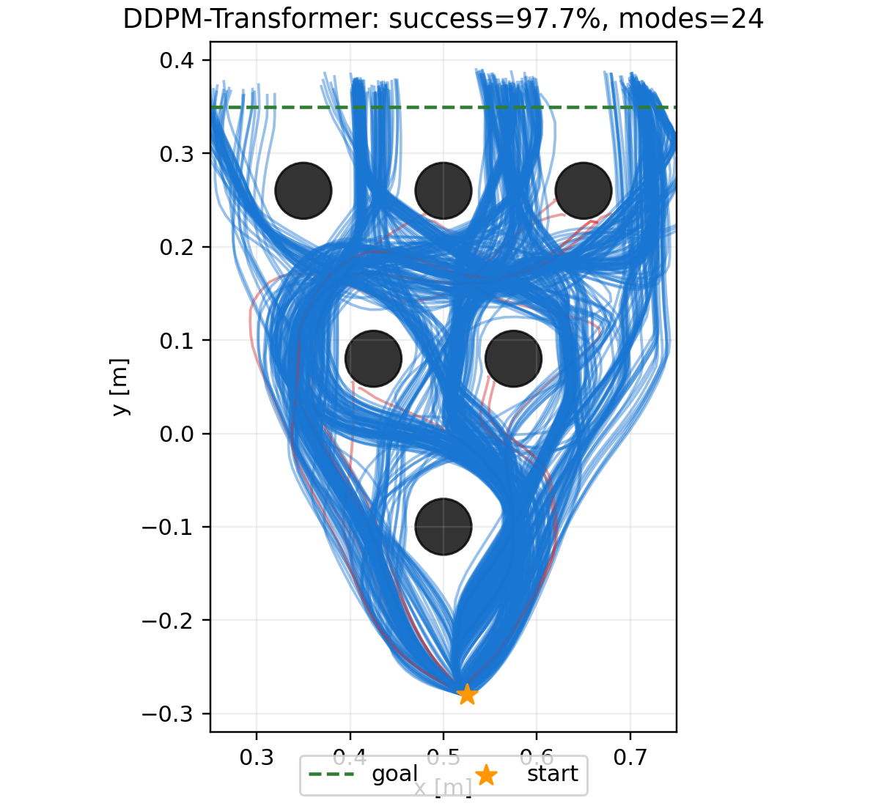

含 DSM Student 轨迹图：

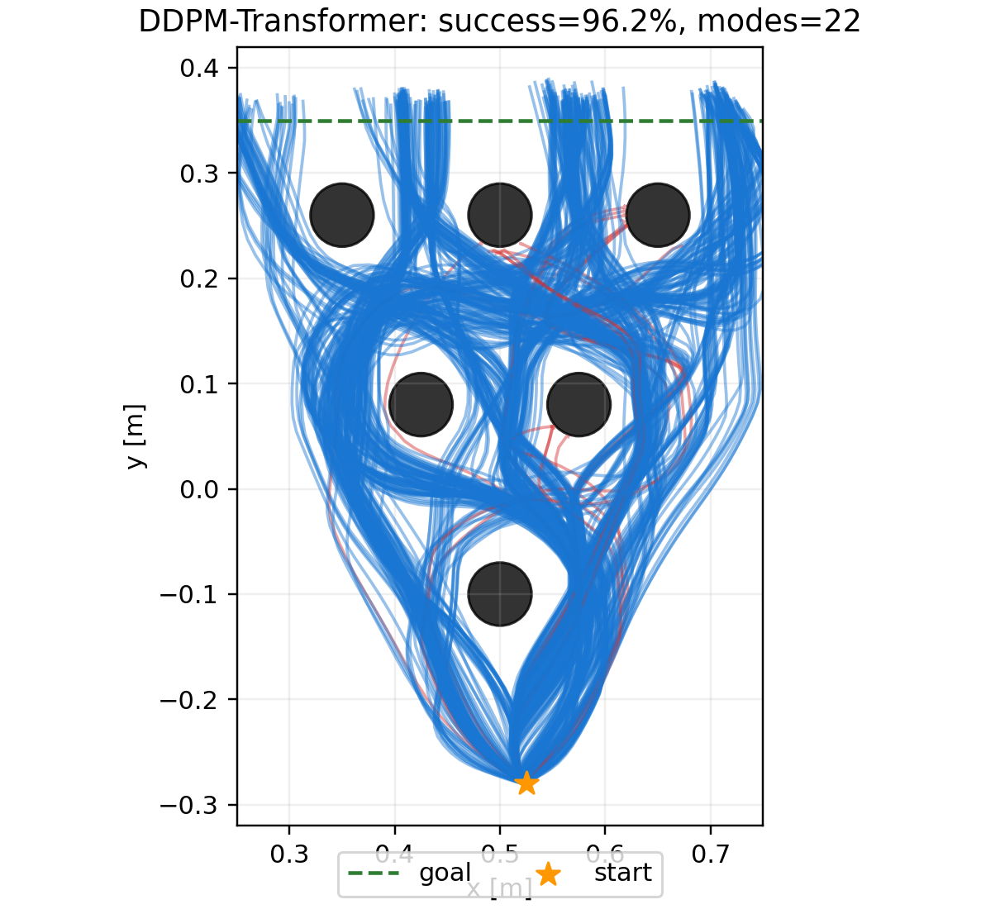

无 DSM Student 轨迹图：

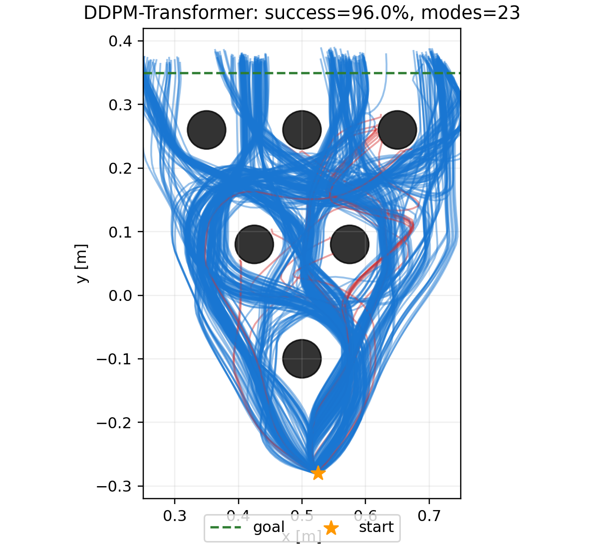

### 7.3 当前分析

8-step DDPM 改为 8-step DDIM 后，成功率从 97.50% 微升至 97.71%，仍覆盖 24/24 模式；但模式熵由 0.913 降至 0.884，有效模式数由 18.19 降至 16.63。这说明多模态分布压缩首先发生在 stochastic DDPM → deterministic DDIM 的 sampler 变化阶段，而不是全部由蒸馏造成。

以正确的 8-step DDIM Teacher 为基线，含 DSM Student 的成功率下降 1.46 个百分点，缺失两个低频模式，熵仅下降 0.005，有效模式数下降 0.26；其 JS divergence 只有 0.0103 nats。由此看，`8 → 4` 蒸馏带来的额外分布变化较小，当前更接近轻微低频 mode loss，而非严重 mode collapse。

无 DSM Student 的成功率为 96.04%，比含 DSM 版本只低 0.21 个百分点；它保留 23/24 模式，熵和有效模式数反而高于含 DSM Student，唯一缺失的是 Teacher 中仅出现一次的 `1-2-3`。因此当前单 seed 实验没有显示 `0.1 * diffusion loss` 能改善多模态保持；但含 DSM Student 与 DDIM Teacher 的 JS divergence 更小，说明 DSM 对整体频率分布的贴合可能略有帮助。两种指标指向不完全一致，需要多 seed 判断。

当前可以将变化分解为：

```text
DDPM -> DDIM：覆盖不变，但熵明显下降
DDIM -> 4-step：成功率小幅下降，1–2 个低频 mode 消失
```

当前只有一个训练 seed 和一个评估 seed；DDIM Teacher 中 `1-2-2` 与 `1-2-3` 本来就分别只有 2 次和 1 次成功，因此有限采样波动足以造成缺失，尚不能据此宣称统计显著的 mode collapse。

## 8. `4 → 2` 蒸馏设置与结果

### 8.1 训练与评估设置

两组实验分别从各自对应的 4-step checkpoint 继续渐进蒸馏，避免在 DSM 消融链路之间交叉初始化。Teacher 与 student 共享初始噪声，teacher 使用 4-step deterministic DDIM，student 使用 2-step deterministic DDIM；训练后先执行单轨迹 smoke test，再以 seed 42 完成 480 条闭环轨迹评估。

| 项目 | DSM=0.1 | DSM=0 |
|---|---:|---:|
| Teacher | 4-step DSM=0.1 student | 4-step DSM=0 student |
| 蒸馏方向 | 4-step → 2-step | 4-step → 2-step |
| 蒸馏 epochs | 500 | 500 |
| Batch size | 256 | 256 |
| Diffusion/DSM loss 权重 | 0.1 | 0 |
| 最佳 epoch | 482 | 491 |
| 最佳总 loss | 0.02350 | 0.00830 |
| Smoke test | 1/1 成功 | 1/1 成功 |

### 8.2 480-rollout 结果

| 模型 | 成功率 | 成功模式 | 模式熵 | 有效模式数 |
|---|---:|---:|---:|---:|
| 4-step Student，DSM=0.1 | 96.25%（462/480） | 22/24 | 0.880 | 16.37 |
| 2-step Student，DSM=0.1 | **95.42%（458/480）** | 21/24 | 0.818 | 13.45 |
| 4-step Student，DSM=0 | 96.04%（461/480） | 23/24 | 0.898 | 17.34 |
| 2-step Student，DSM=0 | **94.79%（455/480）** | 23/24 | 0.844 | 14.60 |

有效模式数按 `exp(H_norm * ln(24))` 计算。

DSM=0.1 的 2-step 轨迹图：

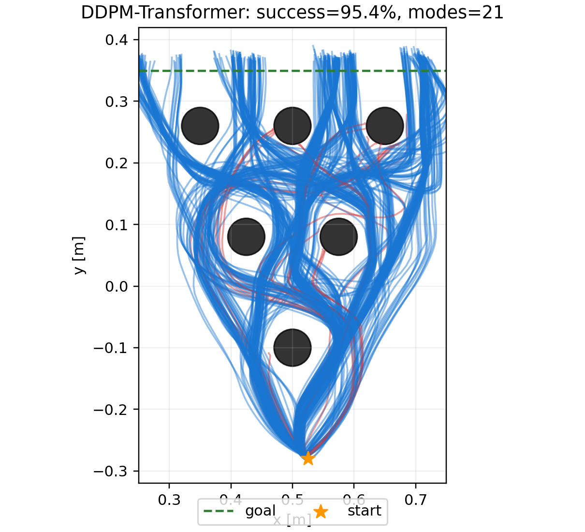

DSM=0 的 2-step 轨迹图：

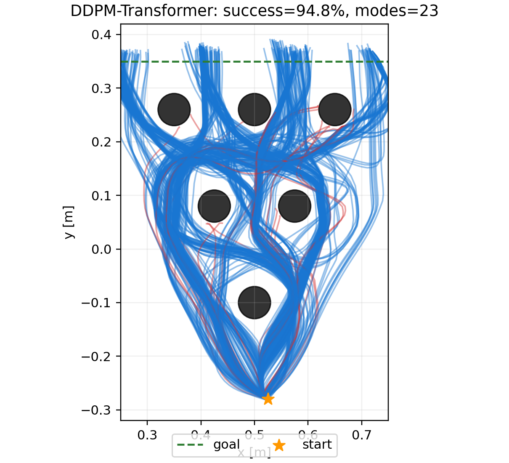

### 8.3 结论

从 4-step 继续压缩到 2-step 后，两组成功率都只下降约 1.2–1.3 个百分点，说明任务完成能力总体仍较稳定；但模式熵下降更明显：DSM=0.1 从 0.880 降至 0.818，DSM=0 从 0.898 降至 0.844，有效模式数分别减少约 2.92 和 2.74。这表明进一步减少采样步数主要损伤的是模式频率均衡性，而不是立即造成大幅成功率崩溃。

在两种 2-step student 之间，DSM=0.1 的成功率高 0.63 个百分点，但只覆盖 21/24 模式；DSM=0 覆盖 23/24 模式，模式熵也高 0.026。当前单 seed 结果仍未证明 `0.1 * DSM loss` 有助于多模态保持，反而显示纯 consistency 分支在 coverage 与 entropy 上更好；不过差异可能受低频模式采样波动影响，仍需多 seed 验证。

综合 `8 → 4 → 2` 的结果，压缩趋势可以概括为：

```text
采样步数减少：成功率缓慢下降
确定性 DDIM 与进一步蒸馏：模式熵持续下降
DSM=0.1：略偏向成功率，但当前未改善模式覆盖或熵
```

因此 2-step 阶段已经出现可测量的多模态压缩，但尚不是彻底的 mode collapse：成功率仍约 95%，且至少保留 21/24 模式。

### 8.4 两条渐进蒸馏路径的指标曲线

下图使用共同的 8-step deterministic DDIM teacher 作为起点，分别连接 DSM=0.1 与 DSM=0 的 `8 → 4 → 2 → 1` 结果。1-step 的最终结果为：DSM=0.1 成功率 6.46%、模式熵 0.619；DSM=0 成功率与模式熵均为 0。

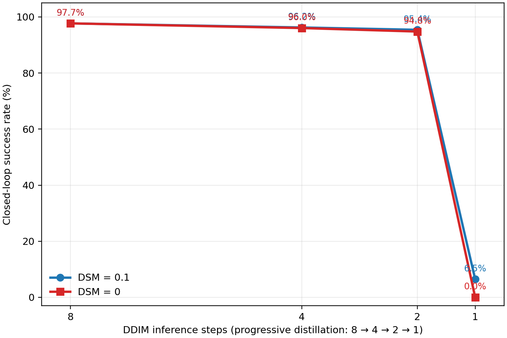

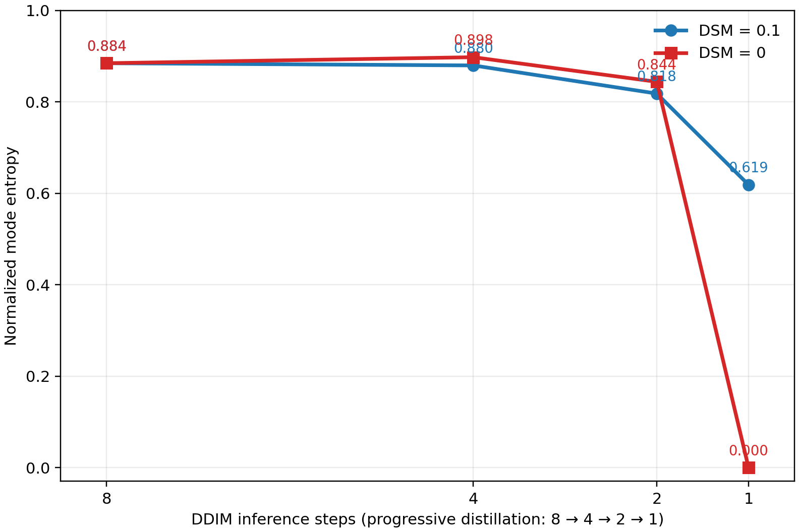

两条曲线都显示 8→4→2 阶段成功率缓慢下降，而 2→1 出现断崖式退化。DSM=0.1 在单步阶段仍保留少量成功轨迹和模式多样性，DSM=0 则完全失效；因此当前瓶颈首先是 one-step 任务能力崩溃，其次才是单独的 mode collapse。

## 9. `2 → 1` 单步蒸馏实验

### 9.1 方法与设置

近期依次评估了三类单步目标，所有正式结果均使用 seed 42 和 480 条闭环轨迹：

| 方法 | 单步训练目标 | Teacher | DSM 权重 |
|---|---|---|---:|
| 简单 endpoint matching | 同一 state、初始噪声下，student 最终动作回归 teacher 最终动作 | 对应的 2-step student | 0 或 0.1 |
| Strict progressive | 解析反演 teacher 两个 DDIM 子步对应的单步 epsilon target | 2-step DSM=0.1 student | 0.1 |
| CTM-style local consistency | 在线 student 在 `x_t` 预测 clean action；EMA target 在相邻 teacher 状态 `x_s` 预测 clean action | 2-step DSM=0.1 student；另做原始 8-step checkpoint 初始化 | 0.1 |
| Boundary-conditioned Consistency Policy | clean-action 边界参数化、多尺度 teacher jump、SNR weighting 与 pseudo-Huber consistency | 原始 8-step checkpoint | 0.1 |
| DMD-style distribution/score | 用 teacher score 与可学习 fake-score 的差更新 one-step generator | 原始 8-step checkpoint | 0.1 |

Strict progressive 和 CTM-style 实现在 `distill_one_step_avoiding.py`。这里的 CTM-style 是局部一致性近似，并非完整 Consistency Trajectory Model：当前网络没有显式目标时间 `s` 输入，也没有完整 CTM 的边界参数化与自适应损失加权。`--teacher-steps` 记录实验来源；CTM-style 内部仍在原始 8 个 diffusion 时间点上构造相邻 teacher transition。因此“2-step/8-step teacher”主要表示 teacher checkpoint 来源与参数，而不是把 CTM 内循环直接切成不同长度的 sampler。

### 9.2 完整结果

| 单步方法 | Epochs | 最佳 epoch | 最佳训练 loss | 成功率 | 成功模式 | 模式熵 |
|---|---:|---:|---:|---:|---:|---:|
| Endpoint，DSM=0.1 | 500 | — | — | 6.46%（31/480） | 10/24 | 0.619 |
| Endpoint，DSM=0 | 500 | — | — | 0.00%（0/480） | 0/24 | 0.000 |
| Strict progressive，2-step teacher | 500 | 448 | 0.003046 | 5.63%（27/480） | 7/24 | 0.589 |
| CTM-style，2-step teacher | 500 | 452 | 0.014611 | 6.25%（30/480） | 8/24 | 0.587 |
| Strict progressive，2-step teacher | 2,000 | 1,792 | 0.002757 | 5.63%（27/480） | 7/24 | 0.562 |
| CTM-style，2-step teacher | 2,000 | 1,920 | 0.011123 | 6.25%（30/480） | 8/24 | 0.585 |
| CTM-style，原始 8-step checkpoint | 2,000 | 1,920 | 0.011697 | **7.29%（35/480）** | 8/24 | 0.584 |
| Boundary-conditioned Consistency Policy | 2,000 | 1,808 | 0.024199 | 7.50%（36/480） | 8/24 | 0.590 |
| DMD-style distribution/score | 2,000 | 0 | 0.795332 | **17.08%（82/480）** | 2/24 | **0.072** |

作为输入基线，2-step DSM=0.1 student 为 95.42%（458/480）、21/24 模式、熵 0.818；2-step DSM=0 student 为 94.79%（455/480）、23/24 模式、熵 0.844。因此性能崩溃明确发生在 `2 → 1`。新的 distribution/score 目标把单步成功率提高到 17.08%，但仍远低于 2-step，而且几乎把全部成功轨迹压缩到两个模式。

500 epochs 增至 2,000 epochs 后，Strict progressive 仍为 27/480，CTM-style 仍为 30/480，模式覆盖也完全不变；训练 loss 虽继续下降，闭环性能没有改善，熵还略有下降。这基本排除了“当前两种实现只是训练轮数不足”的解释，继续堆训练 epochs 的优先级较低。

Strict progressive 的 target loss 很低却没有转化为闭环成功，说明训练目标可拟合不等于单步闭环策略正确：微小动作误差会在早期闭环状态分布中放大。简单 endpoint 方法中 DSM=0 从少量成功直接降至 0，也说明原始数据去噪正则对单步模型仍重要，但 DSM=0.1 本身不足以解决单步分布匹配。

### 9.3 轨迹与运行状态

简单 endpoint DSM=0.1：

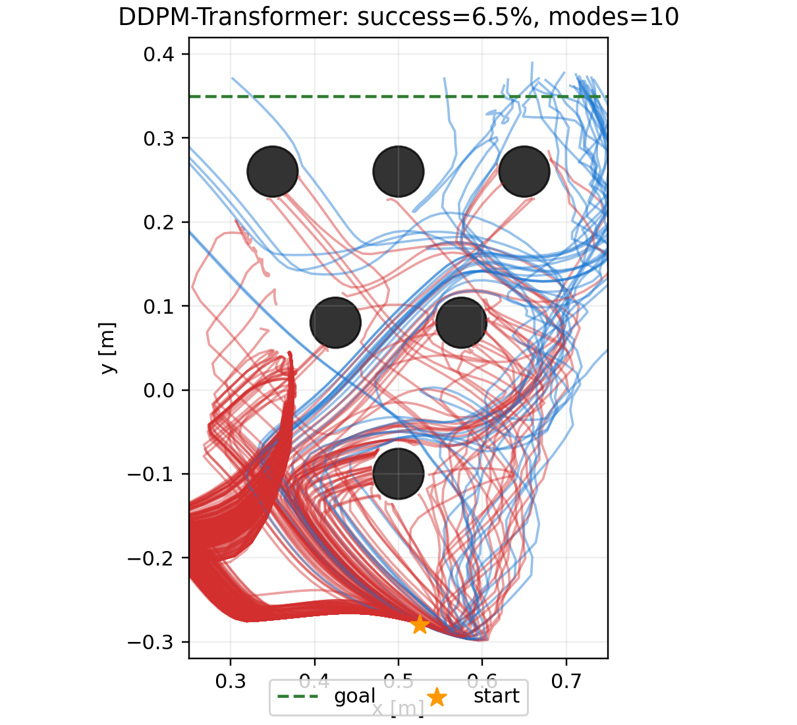

Strict progressive（2,000 epochs）：

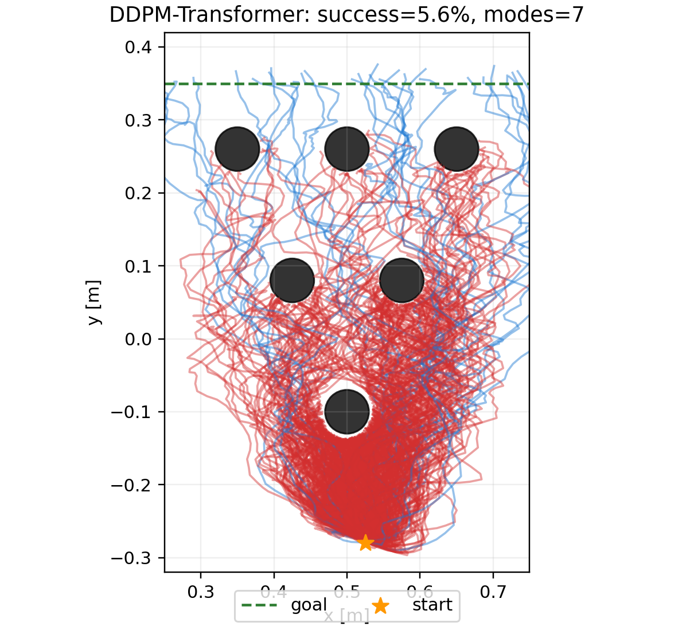

CTM-style（2-step teacher，2,000 epochs）：

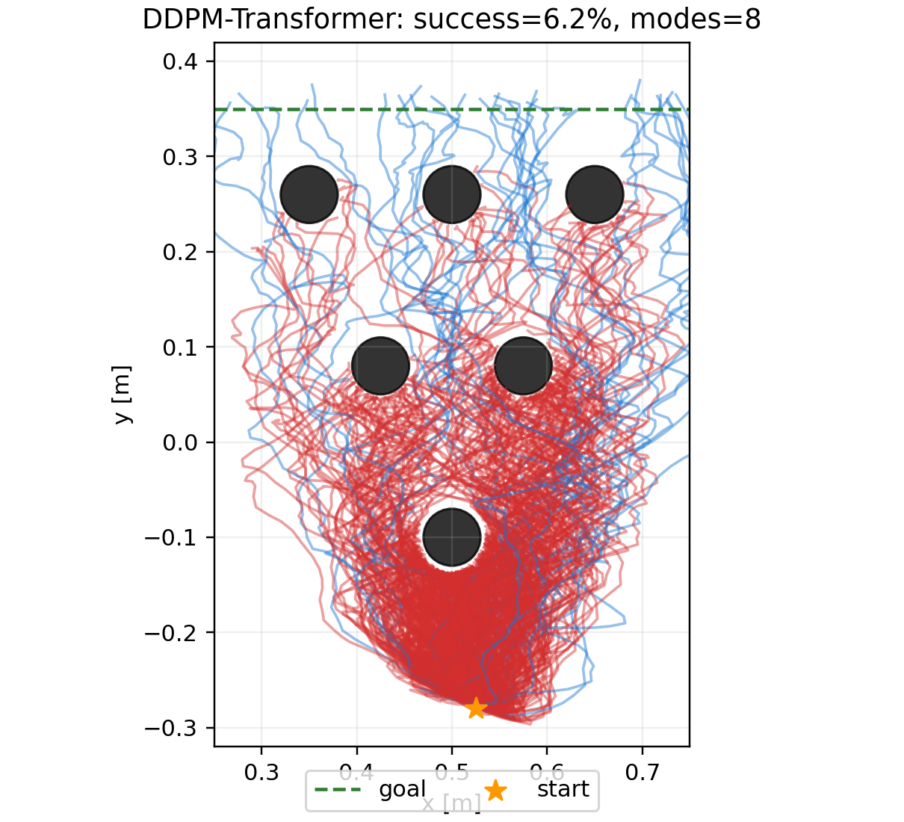

原始 8-step checkpoint 的 CTM-style 训练与评估均已完成；最佳 checkpoint 位于 `logs/avoiding/distilled/ddim_student_1step_ctm_8teacher_2000_seed42/eval_best_ddpm.pth`。完整 480-rollout 结果为 35/480（7.29%）、8/24 模式、熵 0.584。轨迹图如下：

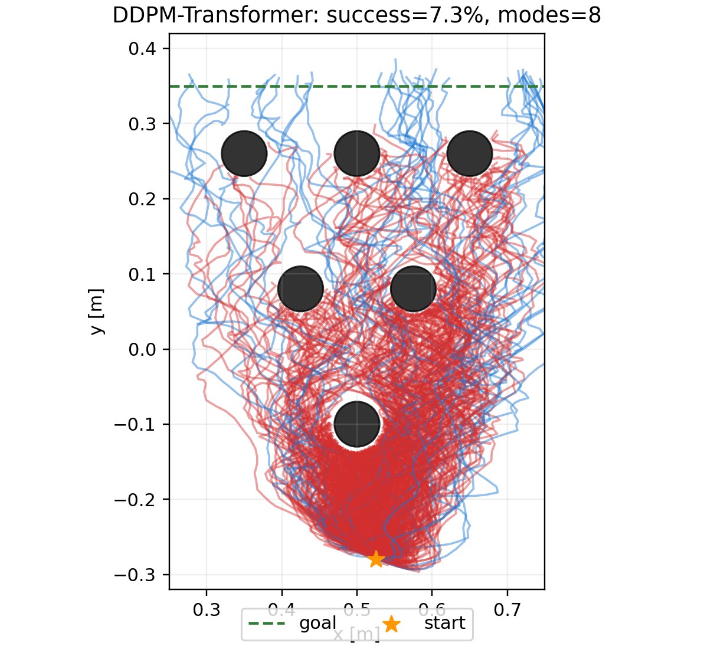

### 9.4 当前判断

1. `8 → 4 → 2` 可保持约 95% 以上成功率，但目前的 `2 → 1` 目标全部发生灾难性闭环退化。
2. 500→2,000 epochs 无收益，主要矛盾是目标/参数化/分布匹配，而不是训练不充分。
3. 原始 8-step checkpoint 初始化将 CTM-style 从 30/480 提升到 35/480，仅增加 5 次成功；模式覆盖同为 8/24，熵从 0.585 微降至 0.584。它没有恢复 teacher 的能力，说明差异不只是 2-step teacher 累积误差。
4. Boundary-conditioned Consistency Policy 为 36/480、8/24、熵 0.590，只比旧 CTM-style 多 1 次成功；边界包装、多尺度跳步和 loss weighting 没有解决闭环能力崩溃。
5. DMD-style 分布目标把成功率提高到 82/480（17.08%），但只保留 2/24 模式，熵降到 0.072。这是“任务成功率改善、分布严重坍塌”的明确反例，不能视为可用的多模态策略。

### 9.5 两种质量改进方案的实现与结论

Boundary-conditioned Consistency Policy 使用以下组合：`f(x_t,t)=c_skip(t)x_t+(1-c_skip(t))x0_pred`、最多四个 diffusion index 的 teacher jump、SNR 权重、pseudo-Huber consistency、EMA target 和 `0.1 × DSM`。120-rollout 为 9/120（7.5%）、5/24 模式、熵 0.449；完整 480 后仍为 7.5%，覆盖回升到 8/24，说明小样本 coverage 波动明显，但成功率没有改善。


DMD-style 分支交替训练 fake-score 网络，并用归一化的 `teacher_epsilon - fake_epsilon` 更新 one-step generator，同时保留 DSM anchor。120-rollout 为 24/120（20%），但只有 1 个模式；完整 480 为 82/480（17.08%）、2/24 模式、熵 0.072，确认不是 120 条采样偶然漏掉少数模式，而是稳定的严重 mode collapse。

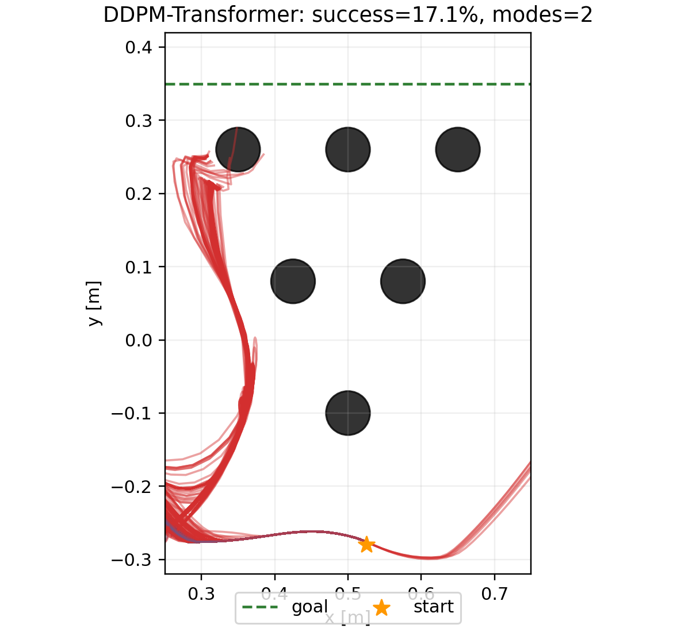

当前 DMD-style 是用于验证方向的原型，不等同于论文中完整稳定的 distribution matching 实现。尤其是训练 loss 规则选出的最佳 checkpoint 为 epoch 0，说明 `abs(distribution_loss)+0.1×DSM` 与闭环质量不一致；后续必须改为周期性闭环验证选 checkpoint，并重新设计 fake-score 更新比、score 时间权重和防坍塌正则。此次结果证明分布目标确实能改变成功率上限，但也证明当前实现会以牺牲多模态为代价。

## 10. 下一步对照实验

1. 为 DMD-style 加入周期性闭环小验证，按成功率与模式熵的联合指标选 checkpoint，不能继续使用当前 distribution loss 选模。
2. 调整 fake-score/generator 更新比、score 时间权重，并加入 teacher mode-frequency matching 或 entropy regularization，直接抑制向单一高频路径坍塌。
3. 将 Consistency Policy 扩展为显式目标时间 `s` 条件与严格 CTM 参数化，避免当前边界 wrapper 仍受原 epsilon 网络参数化限制。
4. 对关键配置扩展多个 evaluation seeds，报告成功率置信区间和聚合 mode distribution。
5. 从原始数据训练原生 one-step/few-step diffusion 强基线，区分蒸馏误差与低步数模型本身的能力上限。

## 11. 实验产物

- 蒸馏脚本：`distill_ddim_avoiding.py`
- 8→4 训练日志：`logs/avoiding/distill_8to4_pipeline.log`
- 8-step DDIM 指标与轨迹：`logs/avoiding/ddim_teacher_8_seed42_480_rollouts/`
- 4-step DSM=0.1 指标与轨迹：`logs/avoiding/distilled/ddim_student_4step_480_rollouts/`
- 4-step DSM=0 指标与轨迹：`logs/avoiding/distilled/ddim_student_4step_nodsm_480_rollouts/`
- 2-step DSM=0.1 指标与轨迹：`logs/avoiding/distilled/ddim_student_2step_dsm01_480_rollouts/`
- 2-step DSM=0 指标与轨迹：`logs/avoiding/distilled/ddim_student_2step_nodsm_480_rollouts/`
- 单步 endpoint DSM=0.1 指标与轨迹：`logs/avoiding/distilled/ddim_student_1step_dsm01_480_rollouts/`
- 单步 endpoint DSM=0 指标与轨迹：`logs/avoiding/distilled/ddim_student_1step_nodsm_480_rollouts/`
- Strict progressive 500/2,000-epoch 结果：`logs/avoiding/distilled/ddim_student_1step_progressive_480_rollouts/`、`logs/avoiding/distilled/ddim_student_1step_progressive_2000_480_rollouts/`
- CTM-style 500/2,000-epoch 结果：`logs/avoiding/distilled/ddim_student_1step_ctm_480_rollouts/`、`logs/avoiding/distilled/ddim_student_1step_ctm_2000_480_rollouts/`
- 原始 8-step checkpoint CTM-style 日志：`logs/avoiding/one_step_ctm_8teacher_2000_pipeline.log`
- 原始 8-step checkpoint CTM-style 评估：`logs/avoiding/distilled/ddim_student_1step_ctm_8teacher_2000_480_rollouts/`
- 单步蒸馏脚本：`distill_one_step_avoiding.py`
- Rollout 精确进度实现：`visualize_avoiding.py`（`--progress-every` 与 `progress.json`）
- Boundary-conditioned Consistency Policy 训练结果：`logs/avoiding/distilled/consistency_policy_v2_2000_seed42/`
- Boundary-conditioned Consistency Policy 120/480 评估：`logs/avoiding/distilled/consistency_policy_v2_2000_120_rollouts/`、`logs/avoiding/distilled/consistency_policy_v2_2000_480_rollouts/`
- DMD-style distribution/score 训练结果：`logs/avoiding/distilled/distribution_v2_2000_seed42/`
- DMD-style distribution/score 120/480 评估：`logs/avoiding/distilled/distribution_v2_2000_120_rollouts/`、`logs/avoiding/distilled/distribution_v2_2000_480_rollouts/`
